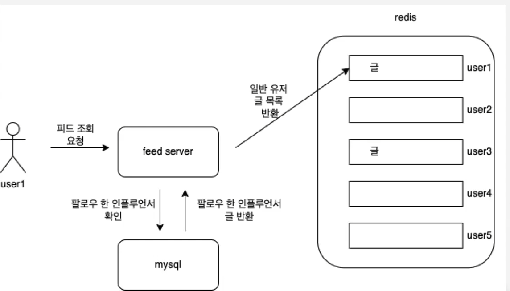

커뮤니티 피드 유즈 케이스
https://fastcampus-community-feed.notion.site/883fa62553224723a74fa97654bc41e8

# 확장을 위한 수치 설정
- 천만명의 유저
- 글 작성은 초당 460회, 피크 타임 1200회
- 타임 라인 조회 초당 3만 회
- 유저 당 평균 팔로워수 30명

- 현재 초 당 생성 되는 타임라인 정보 -> 460 * 30 = 13800건
- 현재 일 당 생성 되는 타임라인 정보 -> 13800 * 86400 = 119만건

## 지금 구조로는 감당하기가 힘들다.
- 테이블의 사이즈, 조회하는 방법 역시도 매우 비효율적
- 무엇보다 초당 30만의 피드 조회를 감당할 수 없다.
- 이를 해결하기 위해선 어떻게 해야할까?
### 피드 데이터 구조 변경, 캐싱을 도입
- 트럼프의 팔로워는 8천 8백만
- 임기 중 발송한 트윗만 2만 5천건
- 트윗 마다 8천 8백만 건의 데이터를 큐에 쌓아야한다
- 그렇게 된다면 트럼프는 2조 건이 넘는 데이터를 쌓는다

### 트위터는 인플루언서들만 처리를 따로 한다.
- 인플루언서의 글들은 db에서 조회를 하고, 일반 유저의 글은 캐싱한다. 

### 리팩토링 프로세스
- 인수 테스트 작성 -> 피드 시스템 내용 적용 및 리팩토링
- 기존 것들에 영향을 최소화 및 유저의 최종 요구사항 만족 확인
